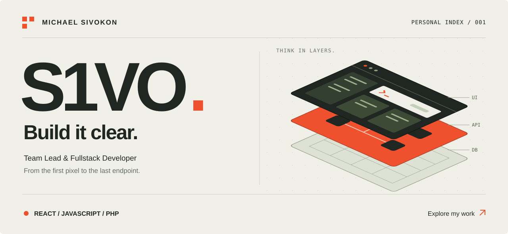
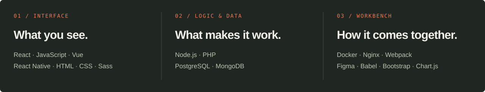

<!-- Upload README.md and the assets directory to the root of s1vo/s1vo. -->

  <a href="https://s1vo-portfolio.vercel.app/"><strong>Explore portfolio ↗</strong></a>
  &nbsp;&nbsp; / &nbsp;&nbsp;
  <a href="https://t.me/s1vo13">Telegram</a>
  &nbsp;&nbsp; / &nbsp;&nbsp;
  <a href="mailto:sivokonma@gmail.com">Email</a>

 

### 01 — Behind the handle

I'm **Michael Sivokon**, a team lead and fullstack developer from Russia.
My main focus is **React**, with **Node.js and PHP** behind the interface.

I like working where design meets engineering: turning complex requirements into interfaces that make sense, then connecting them to the logic and data underneath.

### 02 — The working set

Read the stack as text

| Layer | Technologies |
| :--- | :--- |
| Interface | React, JavaScript, Vue, React Native, HTML, CSS, Sass, Bootstrap |
| Logic & data | Node.js, PHP, PostgreSQL, MongoDB |
| Tools | Docker, Nginx, Webpack, Babel, Figma, Chart.js |

### 03 — Have something in mind?

A React question, an interface to rethink, or a product to build — **[let's talk ↗](https://t.me/s1vo13)**.

[sivokonma@gmail.com](mailto:sivokonma@gmail.com) · [Portfolio](https://s1vo-portfolio.vercel.app/) · [Instagram](https://instagram.com/s1vo13)

---

<strong>S1VO</strong> &nbsp; / &nbsp; Design with intent. Build with care.

